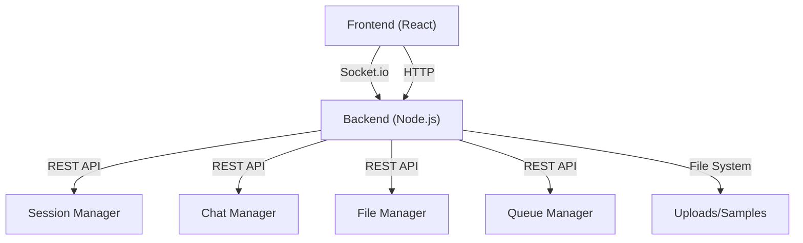

# 🎵 Resync: Real-Time Collaborative Audio Experience

<p align="center">
  
</p>

<p align="center">
  <b>Resync</b> is a modern, full-stack web application for real-time collaborative audio listening, chat, and session management. Built for seamless group experiences, it synchronizes music playback across devices with advanced time sync and robust backend support.
</p>

<p align="center">
  <a href="#-features"></a>
  <a href="#-tech-stack"></a>
</p>

---

## 🚀 Features

- 🎧 **Synchronized Audio Playback**: Listen to music in perfect sync with friends.
- 💬 **Real-Time Chat**: Communicate instantly during sessions.
- 🕒 **Multi-Peer Time Sync**: Advanced algorithms for accurate cross-device timing.
- 📂 **Playlist & File Management**: Upload, manage, and play audio files collaboratively.
- 📱 **Modern UI/UX**: Responsive, mobile-friendly, and visually appealing interface.
- 🔒 **Session Management**: Create, join, and manage listening rooms securely.
- 📊 **Analytics & Resync**: Track sync status and resync as needed.

---

## 🏗️ Architecture



---

## 📂 Folder Structure

```
untitled folder/
├── backend/
│   ├── index.js                # Backend entry point
│   ├── socket.js               # Socket.io server
│   ├── managers/               # Core backend managers
│   ├── routes/                 # REST API routes
│   ├── utils/                  # Utility functions
│   └── uploads/samples/        # Sample audio files
├── frontend/
│   ├── src/                    # React source code
│   ├── public/                 # Static assets
│   ├── package.json            # Frontend dependencies
│   └── ...
└── README.md                   # Project documentation
```

---

## ⚡ Quickstart

### 1. Clone the Repository

```bash
git clone <your-repo-url>
cd untitled\ folder
```

### 2. Backend Setup

```bash
cd backend
npm install
npm start
```

- Server runs on `http://localhost:3000` by default.

### 3. Frontend Setup

```bash
cd ../frontend
npm install
npm run dev
```

- App runs on `http://localhost:5173` by default.

---

## 🛠️ Tech Stack

- **Frontend:** React, Vite, Tailwind CSS
- **Backend:** Node.js, Express, Socket.io
- **State & Sync:** Custom hooks, Context API
- **File Handling:** Node.js FS, REST APIs
- **Other:** ESLint, PostCSS, Firebase (configurable)

---

## 🖥️ Usage Guide

1. **Start Backend & Frontend** as above.
2. **Open the app** in your browser.
3. **Create or join a session** to start listening together.
4. **Upload audio files** or use provided samples.
5. **Chat and control playback** in real time.
6. **Monitor sync status** and resync if needed.

---

## 🤝 Contributing

We welcome contributions! To get started:

1. Fork the repo & create a new branch.
2. Make your changes with clear commit messages.
3. Ensure code is linted and tested.
4. Submit a pull request with a detailed description.

Please read our [Code of Conduct](#) and [Contributing Guide](#) before submitting.

---

## 🔒 Security Practices

- All sensitive configuration (API keys, backend URLs, secrets) must be managed via environment variables and never hardcoded.
- All HTTP endpoints and socket events are rate-limited to prevent abuse.
- All user input is validated and sanitized using Joi (backend) and custom sanitizers (frontend).
- File uploads are virus-scanned and old files are cleaned up automatically.
- Sensitive data is never exposed in API responses or logs.
- HTTP security headers are set using helmet, and HTTPS is enforced in production.
- Dev-only dependencies are excluded from production builds.

## 🛡️ Monitoring & Error Reporting

- For production deployments, set up error and activity monitoring using tools like Sentry, LogRocket, or Datadog.
- Monitor server logs for suspicious activity and rate limit violations.
- Regularly audit dependencies with `npm audit` and keep all packages up to date.

---

## ❓ FAQ

**Q: Can I use my own audio files?**

> Yes! Upload via the UI or place files in `backend/uploads/samples/`.

**Q: How does sync work?**

> The app uses custom time sync hooks and Socket.io events to keep all clients in sync.

**Q: Is this production-ready?**

> This is a demo/experimental project. For production, review security, scalability, and deployment.

---

## 🆘 Support

- Open an [issue](#) for bugs or feature requests.
- Contact the maintainer at [mindreaders7557@gmail.com].
